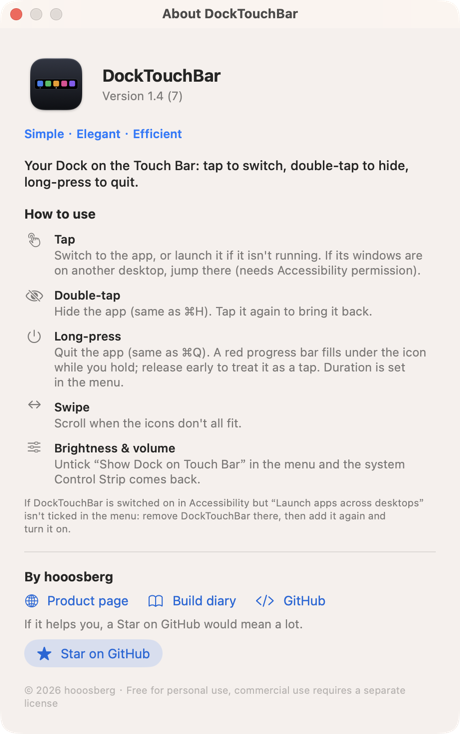

<p align="center">
  
</p>

<h1 align="center">DockTouchBar</h1>

<p align="center">
  <strong>Your Dock on the Touch Bar.</strong>
  <br>
  <strong>Simple · Elegant · Efficient</strong>
  <br>
  Tap to switch · double-tap to hide · long-press to quit
  <br>
  <a href="README.zh-CN.md">简体中文</a> ·
  <a href="https://github.com/hooosberg/DockTouchBar/releases/latest">Download</a> ·
  <a href="https://hooosberg.com/apps/docktouchbar">Product page</a> ·
  <a href="https://hooosberg.com/apps/docktouchbar/diary">Build diary</a>
</p>

<p align="center">
  
  
  
  
  
</p>


*A rendering of the Touch Bar, drawn by the app's own view code with stock macOS apps as samples. Order matches your Dock: Finder → pinned apps → divider → other running apps. A dot marks a running app; the brightest dot is the frontmost one.*

**If DockTouchBar is useful to you, a ⭐ Star on GitHub is the best way to say thanks.**

## Why

Pock, PockV2 and friends can put the Dock on the Touch Bar, but they do a lot more, and in daily use the bar tends to disappear or stop responding. DockTouchBar keeps to one job and does it well.

**Simple**

- One job: your Dock on the Touch Bar. No widgets, no plugins.
- A handful of switches in the menu bar, nothing else to configure.
- About 1,650 lines of Swift in 9 files, no third-party dependencies. The whole app is 1.1 MB.

**Elegant**

- Feels like part of macOS: the same order, icons and running dots as your Dock, on the system's own Touch Bar scroller.
- Gestures that stay out of your way: a tap acts immediately (it never waits to see whether a double-tap is coming), and long-press shows a quiet red progress bar you can back out of.
- Rapid taps feel right: the last tap always wins, and it never fights you. If the system drops a desktop switch or something steals focus, it quietly puts things right, and it stops the moment you touch the keyboard, mouse or trackpad.
- Speaks your language (English / 简体中文) and asks for just one optional permission.

**Efficient**

- Event-driven, no polling. Measured on an M1 MacBook Pro with the Dock showing and idle: **0.0% CPU**, **0 idle wakeups**, about **34 MB** of memory.\*
- Adapts to your Mac instead of using fixed delays: desktop switches wait for the system's own "finished" signal and check the result, so it stays correct whether animations are slow, off, or the machine is busy.
- When apps start or quit, only what changed is updated and your scroll position is kept. Icons are rasterized once and cached.
- Self-healing: re-attaches after sleep, screen unlock and Control Strip restarts, so you never have to relaunch it.
- Fails safe: private APIs are resolved at runtime. If macOS removes one, that feature switches itself off instead of crashing.
- Private: no network access, no analytics, no accounts. It only stores your preferences.

<sub>\* Release build. CPU from five `top` samples 2 s apart (all 0.0%); wakeups from the kernel's per-process counters read 20 s apart (0 idle wakeups, 0 interrupt wakeups, 0.0 ms CPU time in between); memory is the physical footprint from `footprint` (34 MB).</sub>

## Features

| Gesture | What happens |
|---|---|
| **Tap** an icon | Switch to the app, or launch it. If its windows are on another desktop (Space), jump to that desktop |
| **Double-tap** | Hide the app (same as ⌘H). Tap again to bring it back |
| **Long-press** | Quit the app (same as ⌘Q). A red progress bar fills under the icon while you hold; release early and it counts as a tap. Finder can't be quit |
| **Swipe** | Scroll when the icons don't all fit |

Menu bar settings:

- Show Dock on Touch Bar (on / off)
- Show apps pinned in the Dock
- Double-tap an icon to hide the app
- Long-press an icon to quit the app: Off / 1 s / 2 s / 3 s / 5 s
- Language: Follow System / 简体中文 / English
- Launch at login
- Launch apps across desktops — ticked when Accessibility permission is granted; if not, click it to grant
- About — usage guide, product page and build diary links, Star button

Opening the app again from Applications while it is running pops up the menu.


*Long-press: the icon dims and a red bar fills under it. When it's full, the app quits. Let go early and it counts as a tap.*



## Requirements and tested environment

| | |
|---|---|
| Hardware | A Mac with a Touch Bar (MacBook Pro 2016–2022) |
| **Tested on** | **MacBook Pro 13" (M1, `MacBookPro17,1`), macOS 27.0, single display, 3 Spaces, Touch Bar set to "Expanded Control Strip", Stage Manager on** |
| Apple silicon (M1) | ✅ This is the machine it is developed and used on |
| Intel | ⚠️ **Unknown.** The download is a universal binary and the Intel slice starts under Rosetta on an M1 Mac, but it has never run on a real Intel Touch Bar Mac. Reports welcome |
| macOS version | Built with a macOS 13 minimum, but only tested on macOS 27.0. Older versions are untested |

Things to know:

- It uses **private Apple APIs** to keep a Touch Bar on screen from a background app. That is also why it cannot be on the Mac App Store, and why a future macOS update could break it. The private interfaces are resolved at runtime, so if one disappears that feature switches off instead of crashing; `swift tools/probe-private-api.swift` shows which ones your macOS still has.
- The Dock takes the **whole** Touch Bar, so the system Control Strip (brightness, volume) is hidden while it is on. Untick "Show Dock on Touch Bar" in the menu to get it back.
- Left-to-right order matches your Dock: Finder → pinned apps → divider → other running apps.
- With Stage Manager on, macOS animates the window change, so the window can take about half a second to appear on screen. The tapped app becomes the frontmost app in about 40 ms; the rest is the system's animation.

## Install

1. Download `DockTouchBar-<version>.dmg` from [Releases](https://github.com/hooosberg/DockTouchBar/releases/latest).
2. Open it and drag **DockTouchBar** onto **Applications**, then launch it. A Dock icon appears in the menu bar and on the Touch Bar.

> The DMG is signed with a Developer ID certificate and **notarized by Apple**, so it opens like any other app. macOS will only ask you to confirm the first launch. Prefer to compile it yourself? See [Build from source](#build-from-source).

### Accessibility permission (optional)

Jumping to a window on another desktop needs Accessibility permission. Without it everything else works, and tapping an app just brings it to the front without changing desktop.

1. Menu bar icon → **Allow launching apps across desktops…** (once granted, the item reads **Launch apps across desktops** with a tick)
2. In System Settings → Privacy & Security → Accessibility, turn DockTouchBar on.

If it still asks after you turned it on, the old entry is stale (this happens when the app's signature changed): select DockTouchBar in the list, click **−**, then add it again. Or run `tccutil reset Accessibility com.maohuhu.docktouchbar` and repeat step 1.

### If a tap doesn't switch desktops

Right after it happens, run this from a clone of the repo. It is read-only and prints how the app judged that app's windows (which windows exist, which desktop each is on, which ones are real windows, which one it would raise):

```bash
tools/diagnose-switch.sh com.google.Chrome
```

## Build from source

Requires the Xcode command line tools.

```bash
git clone https://github.com/hooosberg/DockTouchBar.git
cd DockTouchBar
scripts/install.sh      # build → copy to /Applications → launch
scripts/make-dmg.sh     # build/DockTouchBar-<version>.dmg
```

Without a signing certificate the build falls back to ad-hoc signing. That works, but macOS treats every ad-hoc rebuild as a new app, so you have to re-grant Accessibility each time. Set `SIGN_IDENTITY="Apple Development: …"` (or a Developer ID certificate) to keep one stable identity.

## Project layout

```
Sources/DockTouchBar/   App source (9 files)
Resources/              Info.plist, app icon
scripts/                build.sh, install.sh, make-dmg.sh, make-icon.sh
tools/                  Diagnostics: private-API check, Spaces/windows inspector, switch diagnostic, rapid-click stress test, offscreen preview
assets/                 README images
```

After a big macOS update, run `swift tools/probe-private-api.swift` to see which private APIs are still available.

## License

[PolyForm Noncommercial License 1.0.0](LICENSE) — free to use, copy, modify and share for **personal and other noncommercial purposes**. **Commercial use is not covered** and needs a separate license from the author; please get in touch via [hooosberg.com](https://hooosberg.com/).

This is a source-available license, not an OSI-approved open source license. Required notice: Copyright © 2026 hooosberg.

## Author

Made by **hooosberg** — [hooosberg.com](https://hooosberg.com/) · [GitHub](https://github.com/hooosberg). If this saved you some taps, please ⭐ the repo.
