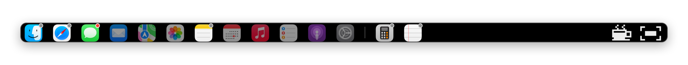
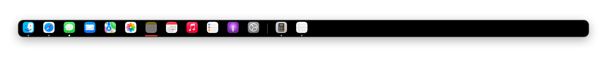
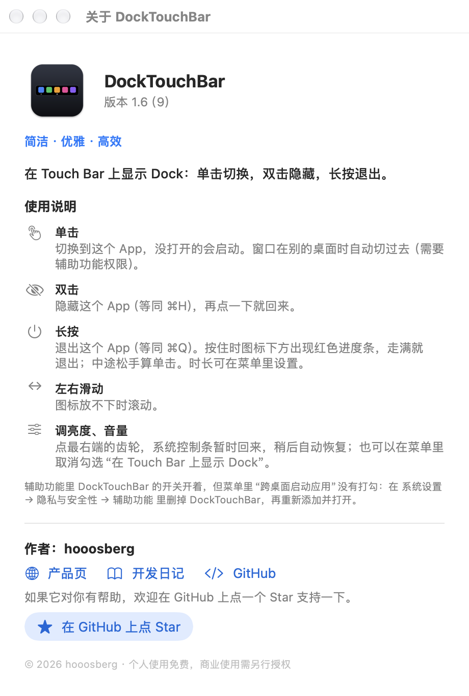

<p align="center">
  
</p>

<h1 align="center">DockTouchBar</h1>

<p align="center">
  <strong>把 Dock 放到 Touch Bar 上。</strong>
  <br>
  <strong>简洁 · 优雅 · 高效</strong>
  <br>
  单击切换 · 双击隐藏 · 长按退出
  <br>
  <a href="README.md">English</a> ·
  <a href="https://github.com/hooosberg/DockTouchBar/releases/latest">下载</a> ·
  <a href="https://hooosberg.com/apps/docktouchbar">产品页</a> ·
  <a href="https://hooosberg.com/apps/docktouchbar/diary">开发日记</a>
</p>

<p align="center">
  
  
  
  
  
</p>



*Touch Bar 的渲染示意图：由 App 自己的界面代码画出，用系统自带 App 做示例。顺序和你的 Dock 一致：访达 → 固定的 App → 分隔线 → 其他正在运行的 App。小圆点表示正在运行，最亮的是当前前台 App。*

**如果 DockTouchBar 对你有用，去 GitHub 点个 ⭐ Star，就是最好的支持。**

## 为什么做

Pock、PockV2 等都能把 Dock 放到 Touch Bar 上，但它们做的事情更多，日常用起来 Touch Bar 容易消失或点了没反应。DockTouchBar 只做一件事，并且把这件事做好。

**简洁**

- 只做一件事：Touch Bar 上的 Dock。没有小组件，没有插件。
- 菜单栏里只有几个开关，没有别的要配置。
- 大约 1650 行 Swift，9 个文件，没有第三方依赖。整个 App 只有 1.1 MB。

**优雅**

- 像 macOS 自带的一部分：图标顺序和运行小圆点都和你的 Dock 一致，用的是系统自己的 Touch Bar 滚动控件。
- 手势不打扰你：单击立刻生效，不会为了等你是不是要双击而延迟；长按时图标下方出现一条安静的红色进度条，Touch Bar 右边缘还会显示“正在关闭…”和倒计时（手指不会挡住），中途松手就取消。
- 连点也很跟手：永远以最后一下为准，也不会和你争。切桌面被系统丢掉、或者焦点被别的 App 抢走，它会悄悄纠正回来；你一动键盘、鼠标或触控板，它立刻停手。
- 跟随你的语言（English / 简体中文），只需要一个可选的权限。

**高效**

- 事件驱动，没有轮询。在 M1 MacBook Pro 上开着 Dock 空闲时实测：**CPU 0.0%**、**空闲唤醒 0 次**、内存约 **34 MB**。\*
- 适应你的电脑，而不是用固定的等待时间：切桌面时等系统自己发出的“切完了”信号并核对结果，动画慢、关掉动画、机器很忙时都不会出错。
- App 启动或退出时只更新变化的部分，滚动位置不会被打断；图标只栅格化一次并缓存。
- 能自己恢复：睡眠唤醒、屏幕解锁、控制条进程重启之后自动重新挂上，不用手动重开。
- 失败时安全：私有接口在运行时解析，系统删掉某个接口时，对应功能自动关闭，而不是崩溃。
- 隐私：不联网，没有统计，没有账号，只保存你的偏好设置。

<sub>\* Release 版本。CPU 是 `top` 连续 5 次采样（间隔 2 秒）都是 0.0%；唤醒次数是读内核的进程计数器、隔 20 秒读两次做差（空闲唤醒 0 次、中断唤醒 0 次、CPU 时间 0.0 ms）；内存是 `footprint` 的物理占用（34 MB）。</sub>

## 功能

| 操作 | 效果 |
|---|---|
| **单击**图标 | 切换到这个 App，没打开的就启动。App 的窗口在别的桌面时，自动切到那个桌面 |
| **双击** | 隐藏这个 App（等同 ⌘H），再点一下就回来 |
| **长按** | 退出这个 App（等同 ⌘Q）。按住时图标下方出现红色进度条，右边缘出现流光的“正在关闭…”倒计时，走满就退出；中途松手算单击。访达不会被退出 |
| **左右滑动** | 图标放不下时滚动 |

菜单栏里的设置：

- 在 Touch Bar 上显示 Dock（开 / 关）
- 显示 Dock 里固定的 App
- 双击图标隐藏 App
- 长按图标退出 App：不启用 / 1 / 2 / 3 / 5 秒
- 语言：跟随系统 / 简体中文 / English
- 登录时自动启动
- 跨桌面启动应用：有辅助功能权限时打勾；没有时点一下去授权
- 关于：使用说明、产品页和开发日记链接、Star 按钮

App 已经在运行时，再从「应用程序」打开它，会直接弹出这个菜单。



*长按：图标变暗，下方出现红色进度条，走满就退出；中途松手算单击。*



## 使用环境和实测情况

| | |
|---|---|
| 硬件 | 带 Touch Bar 的 Mac（MacBook Pro 2016–2022） |
| **实测环境** | **MacBook Pro 13 英寸（M1，`MacBookPro17,1`），macOS 27.0，单显示器，3 个桌面，Touch Bar 设为“展开的控制条”，开着台前调度** |
| Apple 芯片（M1） | ✅ 这就是开发和日常使用的机器 |
| Intel | ⚠️ **未知。** 安装包是通用二进制，在 M1 上用 Rosetta 能启动 Intel 部分，但从没在真正的 Intel Touch Bar 机器上跑过。欢迎反馈 |
| macOS 版本 | 最低按 macOS 13 编译，但只在 macOS 27.0 上测过，更早的版本没测 |

需要知道的几件事：

- 后台 App 要让 Touch Bar 一直显示，只能用 **Apple 的私有 API**。所以它不能上架 Mac App Store，以后 macOS 更新也可能让它失效。私有接口都是在运行时解析的，缺了哪个，对应功能会自己关闭而不是崩溃；运行 `swift tools/probe-private-api.swift` 可以看到你的 macOS 里还有哪些。
- Dock 会占满**整条** Touch Bar，开着的时候系统控制条（亮度、音量）看不到。要用时，点 Touch Bar 最右端的齿轮按钮，暂时把 Touch Bar 还给系统（约 20 秒后自动回来；如果屏幕被调到全黑，则等亮度调回来就自动恢复）。也可以在菜单里取消勾选“在 Touch Bar 上显示 Dock”。
- 图标顺序和你的 Dock 一致：访达 → 固定的 App → 分隔线 → 其他正在运行的 App。
- 开着台前调度时，macOS 会给窗口切换加动画，窗口在屏幕上出现要约半秒。被点的 App 变成前台只要约 40 毫秒，剩下的时间是系统的动画。

## 安装

1. 到 [Releases](https://github.com/hooosberg/DockTouchBar/releases/latest) 下载 `DockTouchBar-<版本>.dmg`。
2. 打开后把 **DockTouchBar** 拖到 **Applications**，再启动它。菜单栏和 Touch Bar 上会出现图标。

> DMG 用 Developer ID 证书签名，并且**已通过 Apple 公证**，所以和普通 App 一样可以直接打开，第一次启动时系统只会让你确认一下。想自己编译的话，见[从源码编译](#从源码编译)。

### 辅助功能权限（可选）

切到别的桌面上的窗口需要辅助功能权限。不给也不影响其他功能，这时点 App 只会把它带到前台，不切桌面。

1. 菜单栏图标 → **允许跨桌面启动应用…**（授权后这一项会变成打勾的“跨桌面启动应用”）
2. 在 系统设置 → 隐私与安全性 → 辅助功能 里打开 DockTouchBar。

如果打开后仍然提示授权，说明旧记录已失效（App 的签名变了就会这样）：在列表里选中 DockTouchBar，点 **−** 删掉，再重新添加。或者运行 `tccutil reset Accessibility com.maohuhu.docktouchbar` 后重做第 1 步。

### 点了没有切到桌面时

出问题之后马上在仓库目录里运行下面这条。它是只读的，会打印程序当时怎么判断这个 App 的窗口：有哪些窗口、各在哪个桌面、哪些是真实窗口、最后会提前哪一个：

```bash
tools/diagnose-switch.sh com.google.Chrome
```

## 从源码编译

需要 Xcode 命令行工具。

```bash
git clone https://github.com/hooosberg/DockTouchBar.git
cd DockTouchBar
scripts/install.sh      # 编译 → 装到 /Applications → 启动
scripts/make-dmg.sh     # 生成 build/DockTouchBar-<版本>.dmg
```

没有签名证书时会退回 ad-hoc 签名。能用，但 macOS 会把每次重新编译的 ad-hoc 版本当成新 App，辅助功能权限每次都要重新授权。设置 `SIGN_IDENTITY="Apple Development: …"`（或 Developer ID 证书）可以固定签名身份。

## 目录结构

```
Sources/DockTouchBar/   App 源码（9 个文件）
Resources/              Info.plist、App 图标
scripts/                build.sh、install.sh、make-dmg.sh、make-icon.sh
tools/                  诊断工具：私有接口检查、桌面与窗口查看、切换诊断、连点压力测试、离屏预览
assets/                 README 里的图片
```

macOS 大版本更新后，运行 `swift tools/probe-private-api.swift` 可以看到哪些私有接口还在。

## 许可证

[PolyForm Noncommercial License 1.0.0](LICENSE)：**个人使用及其他非商业用途**可以免费使用、复制、修改和分享。**商业使用不在授权范围内**，需要向作者另行取得授权，请通过 [hooosberg.com](https://hooosberg.com/) 联系。

这是“源码可见”许可证，不是 OSI 认可的开源许可证。版权声明：Copyright © 2026 hooosberg。

## 作者

**hooosberg** — [hooosberg.com](https://hooosberg.com/) · [GitHub](https://github.com/hooosberg)。如果它帮你省了几次点击，欢迎 ⭐ Star 支持。
