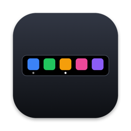
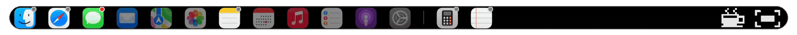
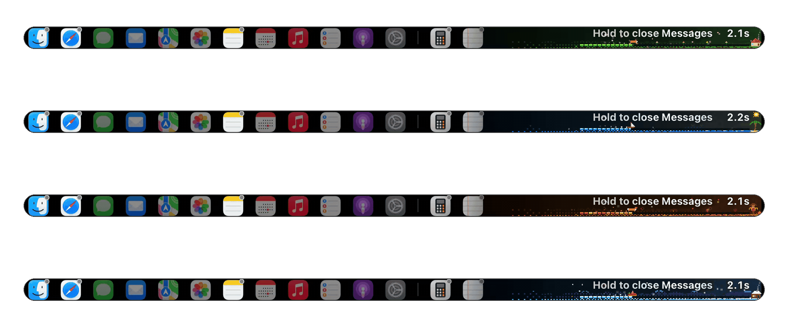

<p align="center">
  
</p>

<h1 align="center">DockTouchBar</h1>

<p align="center">
  <strong>Ihr Dock in der Touch Bar.</strong>
  <br>
  <strong>Einfach · Elegant · Effizient</strong>
  <br>
  Tippen zum Wechseln · Doppeltippen zum Minimieren · Lange drücken zum Beenden
  <br>
  <a href="https://github.com/hooosberg/DockTouchBar/releases/latest">Download</a> ·
  <a href="https://hooosberg.com/apps/docktouchbar">Produktseite</a> ·
  <a href="https://hooosberg.com/apps/docktouchbar/diary">Build-Tagebuch</a>
</p>

<p align="center">
  <a href="../README.md">English</a> ·
  <a href="README.zh-CN.md">简体中文</a> ·
  <a href="README.zh-Hant.md">繁體中文</a> ·
  <a href="README.ja.md">日本語</a> ·
  <a href="README.ko.md">한국어</a> ·
  <a href="README.fr.md">Français</a> ·
  <a href="README.de.md">Deutsch</a> ·
  <a href="README.es.md">Español</a> ·
  <a href="README.pt.md">Português</a> ·
  <a href="README.ru.md">Русский</a> ·
  <a href="README.it.md">Italiano</a> ·
  <a href="README.tr.md">Türkçe</a>
</p>

> **Zwei Editionen:** das normale DockTouchBar und DockTouchBar Vibe, das den Live-Status Ihrer KI-Coding-Agenten auf deren Symbolen zeigt. Unterschiede und Downloads: [English README](../README.md#two-editions).

<p align="center">
  
  
  
  
  
</p>


*Leerlaufzustand: Apps am unteren Ende ausgerichtet mit aktuellem Abzeichen-Punkt oben rechts (rot für vorderste App); Pixel-Art-Kaffeetasse mit animiertem aufsteigendem Dampf.*


*Lange drücken zum Beenden: horizontal scrollende Pixel-Art-Countdown-Szenen über vier Jahreszeiten (Frühlingslaufender Hund / Sommersegelschiff / Herbstwaldfuchs / Winterschlittenfahrt). Früh loslassen zum Abbrechen, mit saisonalem Finale-Burst.*

### ⚡ Energieeffizienz & Native Leistung (Frühere Messergebnisse)

Konstruiert für 24/7-Hintergrundpräsenz mit ereignisgesteuerten App- und Fenster-Updates. Die nachstehenden Messungen stammen aus früheren Versionen; Screenshot-Aktivität verwendet vorübergehend einen kurzen Prozesscheck:

| Metrik | Gemessen | Notizen |
|---|---|---|
| **CPU-Auslastung** | **0,0% ~ 0,8%** | Leerlauf 0,0%; kurze vernachlässigbare Spitzen nur bei App-/Fenster-Wechselereignissen |
| **Physischer Speicherabdruck** | **29 MB** | Gemessen mit macOS `footprint`-Tool, ein Bruchteil von Electron-Alternativen |
| **Energieauswirkung** | **0,0** | Niedrigste mögliche macOS Activity Monitor-Energiebewertung, keine Auswirkungen auf Batterie |
| **Resident Threads** | **4 Threads (alle schlafen bei Ereignissen)** | Kein vielbeschäftigter Wartezustand, kein hochfrequentes Timer-Polling |
| **Netzwerkzugriff** | **GitHub-Update-Checks und Downloads** | Dock-Interaktionen laufen lokal; keine Analytik oder Konten |
| **Render-Latenz** | **~2,3 ms / Frame** | Native CoreAnimation / AppKit-Rendering-Pipeline für sofortige Berührungsreaktivität |

**Wenn DockTouchBar für Sie nützlich ist, ist ein ⭐ Stern auf GitHub die beste Möglichkeit, danke zu sagen.**

## Warum

Pock, PockV2 und Friends können das Dock in der Touch Bar platzieren, aber sie tun viel mehr, und im täglichen Gebrauch hat die Leiste die Neigung zu verschwinden oder nicht zu reagieren. DockTouchBar behält eine Aufgabe und macht sie gut.

**Einfach**

- Eine Aufgabe: Ihr Dock in der Touch Bar. Keine Widgets, keine Plugins.
- Eine Handvoll Schalter in der Menüleiste, sonst nichts zum Konfigurieren.
- Native Swift und AppKit, ohne Abhängigkeiten von Drittanbietern. Pixel-Art-Szenen sind in der Quelle enthalten.

**Elegant**

- Verwendet macOS-Symbole und den System-Touch-Bar-Scroller. Nicht angeheftete laufende Apps erscheinen links, die neueste zuerst; angeheftete Apps behalten ihre Dock-Reihenfolge. Das Schließen einer App behält den aktuellen sichtbaren Bereich.
- Gesten, die aus dem Weg bleiben: Ein Tippen wirkt sofort (es wartet nie, um zu sehen, ob ein Doppeltippen kommt), und langes Drücken zeigt einen stillen Fortschrittsbalken unter dem Symbol, plus einen „Schließen…"-Countdown am rechten Rand der Touch Bar, damit Ihr Finger ihn nie verdeckt, gezeichnet als kleine Pixel-Art-Szene, zwischen der Sie vier Jahreszeiten wechseln können. Früh loslassen zum Abbrechen.
- Schnelle Tippen fühlen sich richtig an: Der letzte Tipp gewinnt immer, und er kämpft nie gegen Sie. Wenn das System einen Desktop-Wechsel fallen lässt oder etwas den Fokus stiehlt, werden die Dinge leise richtig gemacht, und es stoppt, sobald Sie die Tastatur, Maus oder das Trackpad berühren.
- Spricht Ihre Sprache (12 Sprachen, von Englisch bis 简体中文 und 日本語) und fragt nur um eine optionale Berechtigung.

**Effizient**

- Ereignisgesteuerte App- und Fenster-Updates. Frühere Messungen auf einem M1 MacBook Pro mit dem Dock angezeigt und im Leerlauf: **0,0% CPU**, **0 Leerlauf-Wakeups**, ungefähr **32 MB** Speicher.\*
- Passt sich Ihrem Mac an, anstatt feste Verzögerungen zu verwenden: Desktop-Wechsel warten auf das eigene „fertig"-Signal des Systems und überprüfen das Ergebnis, sodass es korrekt bleibt, ob Animationen langsam sind, ausgeschaltet oder der Computer beschäftigt ist.
- Wenn Apps starten oder beenden, wird nur das Geänderte aktualisiert und Ihre Scroll-Position wird beibehalten. Symbole werden einmal rasterisiert und zwischengespeichert.
- Selbstheilend: Stellt sich nach Schlaf, Bildschirmfreigabe und Control Strip-Neustarts wieder her, sodass Sie es nie neu starten müssen.
- Sicher scheitern: Private APIs werden zur Laufzeit aufgelöst. Wenn macOS eine entfernt, schaltet sich diese Funktion selbst aus, anstatt abzustürzen.
- Datenschutz: Keine Analytik oder Konten. Dock-Interaktionen laufen lokal; automatische Update-Checks und angeforderte Downloads verbinden sich mit GitHub. Einstellungen bleiben auf Ihrem Mac.

<sub>\* Release-Build. CPU von fünf `top`-Samples 2 s auseinander (alle 0,0%); Wakeups aus den Kernel-Pro-Prozess-Zählern, die 20 s auseinander gelesen werden, drei mal auf 1.10 (0 Leerlauf-Wakeups und 0 Interrupt-Wakeups jedes Mal; ein früherer Durchlauf auf 1.8 sah 0–7 Interrupt-Wakeups von Systemereignissen); Speicher ist der physische Speicherabdruck von `footprint` (32 MB). Der Dampf über der Kaffeetasse wird vom Render-Prozess des Systems gezeichnet, nicht von der App.</sub>

## Funktionen

| Geste | Was passiert |
|---|---|
| **Tippen** auf ein Symbol | Zur App wechseln oder starten. Wenn sich die Fenster auf einem anderen Desktop (Space) befinden, zum Desktop wechseln |
| **Doppeltippen** | Aktuelles Fenster minimieren wie sein gelber Button. Benötigt Bedienungshilfen-Berechtigung. Erneut tippen zum Wiederherstellen |
| **Lange drücken** | App schließen und immer sagen, was passiert ist. Ein Fortschrittsbalken füllt sich unter dem Symbol während des Haltens, und ein „Schließen…"-Countdown erscheint am rechten Rand über einer Pixel-Art-Jahreszeit (Ihre Auswahl im Menü); früh loslassen und es zählt als Tippen. Die App wird immer vollständig beendet (wie ⌘Q), unabhängig von der Anzahl der Fenster oder ob sie minimiert oder ausgeblendet sind. Finder kann nicht beendet werden, daher werden alle seine Fenster stattdessen geschlossen (auch minimierte; wenn sie sich auf einem anderen Desktop befinden, wird zuerst dorthin gesprungen). Wenn die App nicht geschlossen werden kann, weil sie auf Sie wartet (ein „ungespeicherte Änderungen"-Blatt) oder nicht geschlossen wird, wechselt die Touch Bar dorthin, über Desktops, und sagt es Ihnen |
| **Papierkorb** | Tippen öffnet das Papierkorb-Fenster in Finder; doppeltippen minimiert es; lange drücken schließt es. Es wird gedimmt, wenn das Fenster geschlossen ist (und verschwindet im Modus „Nur laufende Apps anzeigen") |
| **Wischen** | Scrollen, wenn die Symbole nicht alle passen; das Schließen einer App behält den aktuellen Bereich in Sicht |
| **Kaffeetasse** (rechtes Ende mit animiertem Dampf) | Machen Sie eine Pause: Verstecken Sie das Dock für einen Moment und geben Sie die Touch Bar an das System zurück (Helligkeit, Lautstärke). Es kehrt nach 10–60 s von alleine zurück |
| **Mittlerer / Maximierungsbutton** (äußerstes rechts) | Zentrieren Sie das Fenster der vordersten App; tippen Sie erneut zum Maximieren (füllt den nutzbaren Bereich, keine native Vollbildschirm), und erneut zum Zentrieren. Wenn Sie das Fenster selbst bewegt haben oder Apps gewechselt haben, wird es zuerst zentriert, und das Symbol folgt dem aktuellen Fenster-Status. Benötigt Bedienungshilfen-Berechtigung |

Das Menüleistenmenü behält die alltäglichen Schalter: Dock in Touch Bar anzeigen, Nur laufende Apps anzeigen (standardmäßig aus: angeheftete Apps werden auch angezeigt; Apps, die gedimmt würden, einschließlich Finder ohne Fenster und ein geschlossener Papierkorb, werden ausgeblendet, und Finder sitzt am weitesten links), Symbole zentrieren (wenn sie passen; sobald sie überlaufen, beginnen sie von links und scrollen), Mittleren / Maximierungsbutton anzeigen und Bei Anmeldung starten. **Einstellungen…** öffnet das Einstellungsfenster, das drei Seiten hat:

- **Einstellungen** — Symbol-Abstand; Zeit zum Verbergen nach dem Tippen auf die Kaffeetasse (10 / 20 / 30 / 60 s); Größe des zentrierten Fensters (60–100% der Bildschirmhöhe; Breite gleich Höhe oder 50–100% der Bildschirmbreite); doppeltippen zum Minimieren; lange drücken zum Schließen (Aus / 1 / 2 / 3 / 5 s) und sein Stil (Frühling / Sommer / Herbst / Winter, mit kurzer Vorschau in der Touch Bar); Nachgiebigkeit gegenüber System-Touch-Bar-Steuerelementen (unabhängige Screenshot-/Aufzeichnungs- und Fn-Schalter, standardmäßig eingeschaltet); Sprache (Systemeinstellung folgen oder eine von 12 Sprachen — oben auf der Einstellungsseite angezeigt; es übersetzt auch die Touch-Bar-Meldungen zum langen Drücken); Bedienungshilfen-Berechtigung-Status mit Verknüpfung zu Systemeinstellungen (sonst benötigt keine Berechtigung); und die Diagnose „Warum kann ich das Dock nicht sehen?"
- **Wie man es benutzt** — Gesten und Buttons
- **Über** — Version, Update-Check, Produktseite und Build-Tagebuch-Links, Star-Button

Die App hat auch ein Symbol im Dock, daher können Sie es nach der Installation von dort aus starten.

Das erneute Öffnen der App aus Anwendungen während der Ausführung zeigt das Menü an.

## Anforderungen und getestete Umgebung

| | |
|---|---|
| Hardware | Ein Mac mit einer Touch Bar (MacBook Pro 2016–2022) |
| **Getestet auf** | **MacBook Pro 13" (M1, `MacBookPro17,1`), macOS 27.0, einzelnes Display, 3 Spaces, Touch Bar auf „Erweiterter Control Strip" eingestellt, Stage Manager aktiviert** |
| Apple silicon (M1) | ✅ Dies ist der Computer, auf dem es entwickelt und verwendet wird |
| Intel | ⚠️ **Unbekannt.** Der Download ist eine universelle Binärdatei und der Intel-Slice startet unter Rosetta auf einem M1 Mac, aber es hat nie auf einem echten Intel-Touch-Bar-Mac laufen. Berichte willkommen |
| macOS-Version | Erstellt mit macOS 13 Minimum, aber nur auf macOS 27.0 getestet. Ältere Versionen sind ungetestet |

Dinge, die Sie wissen sollten:

- Es verwendet **private Apple-APIs**, um eine Touch Bar im Hintergrund von einer Hintergrund-App auf dem Bildschirm zu halten. Das ist auch der Grund, warum es nicht auf dem Mac App Store sein kann, und warum ein zukünftiges macOS-Update es brechen könnte. Die privaten Schnittstellen werden zur Laufzeit aufgelöst, wenn also eine verschwindet, schaltet sich diese Funktion aus, anstatt zu Crash; `swift tools/probe-private-api.swift` zeigt, welche Ihr macOS noch hat.
- Das Dock nimmt die **gesamte** Touch Bar, daher ist der System-Control-Strip (Helligkeit, Lautstärke) verborgen, während es eingeschaltet ist. Tippen Sie auf die kleine Kaffeetasse rechts neben der Leiste, um das Dock für einen Moment zu verstecken und die Touch Bar an das System zurückzugeben (es kehrt nach 10–60 Sekunden automatisch zurück, 20 Sekunden standardmäßig — oder, wenn der Bildschirm ganz gedimmt war, sobald die Helligkeit erhöht wird). Sie können auch „Dock in Touch Bar anzeigen" im Menü deaktivieren.
- Von links nach rechts Reihenfolge: nicht angeheftete laufende Apps (neueste zuerst) → Teiler → Finder → angeheftete Apps in Dock-Reihenfolge → Teiler → Papierkorb. Neu gestartete nicht angeheftete Apps kommen links in die Ansicht; das Wechseln zwischen offenen Apps ordnet sie nicht neu. Tippen Sie auf Papierkorb, um ihn in Finder zu öffnen.
- Mit Stage Manager eingeschaltet animiert macOS den Fenster-Wechsel, daher kann es etwa eine halbe Sekunde dauern, bis das Fenster auf dem Bildschirm erscheint. Die angetippte App wird in etwa 40 ms die vorderste App; der Rest ist die Animation des Systems.

## Installieren

1. Laden Sie `DockTouchBar-<version>.dmg` von [Releases](https://github.com/hooosberg/DockTouchBar/releases/latest) herunter.
2. Öffnen Sie es und ziehen Sie **DockTouchBar** auf **Anwendungen**, dann starten Sie es. Ein Dock-Symbol erscheint in der Menüleiste und in der Touch Bar.

> Die DMG ist mit einem Developer ID-Zertifikat signiert und **von Apple notarisiert**, daher öffnet es sich wie jede andere App. macOS fragt Sie nur, um die erste Inbetriebnahme zu bestätigen. Möchten Sie es lieber selbst kompilieren? Siehe [Aus Quelle erstellen](#aus-quelle-erstellen).

### Bedienungshilfen-Berechtigung (optional)

Die Bedienungshilfen ermöglichen das Wechseln von Cross-Desktop-Fenster, Doppeltippen-Minimierung, Zentrieren / Maximieren, Schließen von Finder-Fenster, Erkennung von Bestätigungsdialogen und Fn-Nachgiebigkeit. Ohne sie bleiben grundlegende Starten und Aktivieren verfügbar; diese Funktionen sind eingeschränkt.

1. Menü-Bar-Symbol → **Einstellungen…** → **Berechtigungen** → **Einschalten…** (sobald gewährt, wird **Bedienungshilfen: an** angezeigt)
2. In Systemeinstellungen → Datenschutz & Sicherheit → Bedienungshilfen schalten Sie DockTouchBar ein.

Wenn es nach dem Einschalten weiterhin fragt, ist der alte Eintrag veraltet (dies passiert, wenn sich die Signatur der App geändert hat): Wählen Sie DockTouchBar in der Liste aus, klicken Sie auf **−**, dann fügen Sie es erneut hinzu. Oder führen Sie `tccutil reset Accessibility com.maohuhu.docktouchbar` aus und wiederholen Sie Schritt 1.

### Wenn ein Tippen keine Desktops wechselt

Direkt nachdem es passiert ist, führen Sie dies von einem Klon des Repositorys aus. Es ist schreibgeschützt und zeigt, wie die App diesen App-Windows beurteilt hat (welche Fenster existieren, welcher Desktop jeder ist, welche echte Fenster sind, welche es heben würde):

```bash
tools/diagnose-switch.sh com.google.Chrome
```

## Kann das Dock nicht sehen?

Die häufigste Ursache: Systemeinstellungen → Tastatur → „Touch Bar zeigt" ist auf „F1-, F2-, etc.-Tasten" eingestellt, was die gesamte Touch Bar mit Funktionstasten füllt. Seit Version 1.16 erkennt die App dies und bietet an, es beim ersten Start auf „Erweiterter Control Strip" zu wechseln. Sie können auch auf „Diagnose: Warum kann ich das Dock nicht sehen?" im Menüleisten-Menü klicken, um jede mögliche Ursache zu überprüfen und einen Bericht zum Senden zu kopieren. Das Halten von Fn zeigt danach weiterhin F1–F12.

## Aus Quelle erstellen

Erfordert die Xcode-Kommandozeilenwerkzeuge.

```bash
git clone https://github.com/hooosberg/DockTouchBar.git
cd DockTouchBar
scripts/install.sh      # build → copy to /Applications → launch
scripts/make-dmg.sh     # build/DockTouchBar-<version>.dmg
```

Ohne ein Signaturzertifikat fällt der Build auf ad-hoc-Signierung zurück. Das funktioniert, aber macOS behandelt jeden ad-hoc-Neuaufbau als neue App, daher müssen Sie jedes Mal Bedienungshilfen erneut gewähren. Setzen Sie `SIGN_IDENTITY="Apple Development: …"` (oder ein Developer-ID-Zertifikat), um eine stabile Identität zu behalten.

## Projektlayout

```
Sources/DockTouchBar/   App source
Resources/              Info.plist, app icon
scripts/                build.sh, install.sh, make-dmg.sh, make-icon.sh
tools/                  Diagnostics: private-API check, Spaces/windows inspector, switch diagnostic, rapid-click stress test, offscreen preview, and render-seasons.sh (the README screenshots)
assets/                 README images
```

Führen Sie nach einem großen macOS-Update `swift tools/probe-private-api.swift` aus, um zu sehen, welche privaten APIs immer noch verfügbar sind.

## Lizenz

[PolyForm Noncommercial License 1.0.0](../LICENSE) — kostenlos zu verwenden, kopieren, ändern und weitergeben für **persönliche und andere nichtkommerzielle Zwecke**. **Kommerzielle Nutzung ist nicht abgedeckt** und benötigt eine separate Lizenz vom Autor; bitte kontaktieren Sie via [hooosberg.com](https://hooosberg.com/).

Dies ist eine quellenverfügbare Lizenz, keine OSI-genehmigte Open-Source-Lizenz. Erforderlicher Hinweis: Copyright © 2026 hooosberg.

## Autor

Hergestellt von **hooosberg** — [hooosberg.com](https://hooosberg.com/) · [GitHub](https://github.com/hooosberg). Wenn dies Ihnen einige Tippen sparte, bitte ⭐ das Repositorium.
